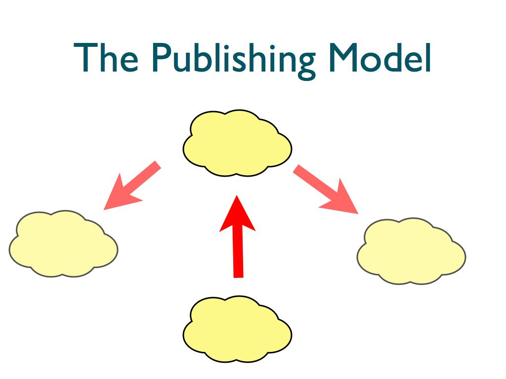

# Session 3 Notes

## Twitter bootstrap

Last time we looked at how you can use CSS to change the appearance of your site. Making things look good with CSS is a bit of an art, which is only really acquired over time (or not, in my case!). Thankfully there are pre-existing solutions out there to make your life easier.

[Twitter bootstrap](http://twitter.github.com/bootstrap/) is set of CSS (& Javascript) files, released by the makers of twitter. It makes a lot easier to produce websites that won't make you want to sick up into your mouth everytime you look at them. We'll now look at adding twitter bootstrap to your `first_site/index.html` page (you should have renamed your page to this as part of the homework).

To start with go to the [twitter bootstrap](http://twitter.github.com/bootstrap) website (notice that it's hosted at github, like ours is!) and click the download button. When you've downloaded and unzipped the file, copy the `bootstrap` folder into your `first_site` folder.

When we covered CSS last time I mentioned that there are a few different ways of including it in your webpage. We did it by putting the css inside a `` tags in the `<head>` of your page. This time we're going to do it by linking to a separate css file. This is more efficient, as it means that when someone's browsing your site they don't have to download the css file for each new page. In the head section of your `first_site/index.html` put the following line:

    <link href='bootstrap/css/bootstrap.css' rel='stylesheet'>

You can also remove the `` tags and delete your css from last time if you want.

When you go to your browser and press refresh, things should look slightly better - bootstrap chooses slightly nicer fonts than the browser does by default. To get the full effects of bootstrap we need to tweak our html.

First thing we're going to do is centre our content on the page. To find out how, we'll look at the bootstrap documentation: go to the bootstrap website, and click on the `Scaffolding` tab. Then navigate to the [Layouts section](http://twitter.github.com/bootstrap/scaffolding.html#layouts). We're going to do a fixed width layout. The docs tell us that we need to have a `
 .. 
` surrounding the bit we want centered, and give an example of where to put this:

    <body>
      

        ...
      

    </body>

Go to your file, and put a `
` immediately after the `<body>` tag, and a `
` immediately before the `</body>` tag. When you save the file, and refresh the page in your browser you should see the content in the center of your page.

This workflow is pretty common:
1. find something you want to change
2. have a look in the bootsrap docs
3. make the suggested change and see how it looks.
    
We'll now do the same thing to make the table look nicer. Check out `Base CSS > Tables` on the boostrap site. It asks you to change your `<table>` tag so it looks like:

    <table class="table">

If you do this, save, and refresh, your table should look a lot nicer. You should spend a bit of time checking out the bootstrap site, and see if you can make the rest of your site look a bit better!

Note: in css the last rule wins (all else being equal - generally more specific rules will win e.g. `div#title` beats `div`). If you link to another stylesheet _after_ twitter bootstrap (or put in `` tags) then these will be applied on top of the bootstrap files. If you put the link or tags in _before_ they will probably be overridden by bootstrap.

## Collaboration: Publishing model

Last time we looked at pushing your code up to github. Push up the changes you've just made to your site:

    cd first_site
    git add .
    git commit -m "Added twitter bootstrap"
    git push

You can think of this code as being published on github for others to read. This brings us to our first way of collaborating with others:

## Conflicts

## Collaboration: Forking model

## Coallaboration: Sharing model

Grab a copy of a repository from github:

    git clone git://github.com/TomClose/first_site.git toms_site

Update a local repo from a changed online version:

    git pull

Setting a new upsteam repository:

    git remote add tom <name of repository from github>

